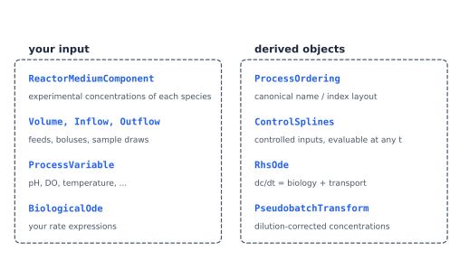
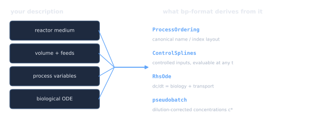

---
jupytext:
  text_representation:
    extension: .md
    format_name: myst
    format_version: 0.13
kernelspec:
  display_name: Python 3
  language: python
  name: python3
---

# bp-format guide

> **In one sentence.** bp-format describes a bioprocess run as data, checks that
> description, and turns it into a differentiable ODE right-hand side.
>
> **You need this if** you are getting data in, or want to know what the package derived
> from it. **You can skip it if** you only ever consume datasets someone else built, 
> though [Validating and inspecting](validate_and_inspect.md) is still worth ten minutes.

bp-format does **not** train models and does **not** integrate ODEs. It owns the
description and the physics; solving is [bp-train](../train/index.md)'s job.

## What it gives you




You write the left column once. The right column is generated, and is the single source
of truth for layout everywhere downstream: bp-train never re-derives it.

## The pages

| Page | Read it when |
|---|---|
| [The data model](data_model.md) | You are deciding which object holds which measurement. |
| [Loading and saving](load_and_save.md) | You need the on-disk format, or someone sent you a file. |
| [Validating and inspecting](validate_and_inspect.md) | Always. Before modeling anything. |
| [Volume, feeds and events](volume_feeds_events.md) | Your process is not a pure batch. |
| [Time series and splines](time_series_and_splines.md) | You need continuous interpolation, or fed-batch dilution correction. |
| [The Bioprocess ODE](bioprocess_ode.md) | You want to see or change the assembled equations. |
| [Limits and gotchas](limits_and_gotchas.md) | Something you expected to work does not. |
| [Further reading](further_reading.md) | You want the exhaustive reference. |

## The shortest possible complete example

```{code-cell} ipython3
import numpy as np
import bp_format as bp

process = bp.BioProcess(
    metadata=bp.BioProcessMetadata(name="run_1", process_type="batch"),
    time_axis=bp.TimeAxis(unit="h", start=0.0, end=10.0,
                          time_reference="inoculation"),
    volume=bp.Volume(initial_volume=1.0, unit="L"),
    reactor_medium=bp.ReactorMedium(
        name="medium", density=1.0, density_unit="kg/L",
        components={
            "biomass": bp.ReactorMediumComponent(
                name="biomass", unit="g/L",
                concentration=bp.TimeSeries(
                    times=np.array([0.0, 5.0, 10.0]),
                    values=np.array([0.1, 1.2, 4.0]),
                ),
            )
        },
    ),
)

ok, messages = bp.validate_process(process)
print("valid:", ok)
print("auto-generated dynamics:", process.biological_ode.derivatives)
```

Four required arguments, one component, and you already have a valid process with a
generated ODE. Everything else in this guide is about the cases where that default is
not what you meant.

## Two conventions to carry with you

**Import as `bp`.** Every dataclass is re-exported from the package root
(`bp.BioProcess`, `bp.TimeSeries`, …). Functions are grouped on module handles instead:
`bp.serialization.*`, `bp.validate.*`, `bp.mechanistic.*`, `bp.splines.*`. The
inspection helpers are the exception: `bp.plot_process` and friends are on the root.

**Amounts, not concentrations, are what conserve.** bp-format tracks concentrations
because that is what you measure, but every transport term it generates is derived from
an amount balance. When something looks wrong, check the volume first.

## See also

- [Concepts and vocabulary](../start/concepts.md), if any term above was unfamiliar.
- [Tutorial 1](../tutorials/01_your_first_dataset.md): the same material as a walkthrough.
- [API reference](../autoapi/bp_format/index): every signature.

```{toctree}
:maxdepth: 1
:hidden:
data_model
load_and_save
validate_and_inspect
volume_feeds_events
time_series_and_splines
bioprocess_ode
limits_and_gotchas
further_reading
```
