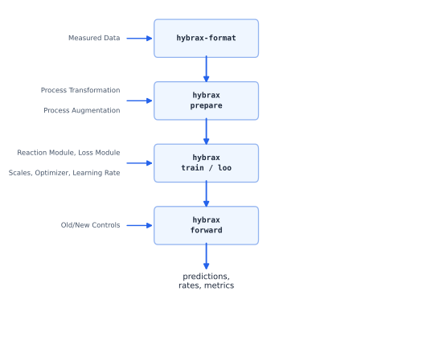
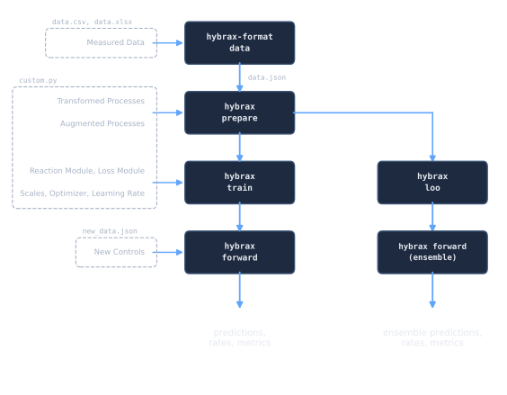

# Concepts and vocabulary

> **In one sentence.** Every term these docs use, defined once, in the order you meet
> them.
>
> **You need this if** a page used a word like *RMC*, *controlled*, *SCL* or *ADF*
> without explaining it. **You can skip it if** you already speak this dialect, but it
> is worth one read, because a few of these words mean something narrower here than in
> general usage.

## The shape of the whole thing




The single most useful thing to internalise: **bp-format owns the transport, you own the
biology.** Dilution, feed inflow, sample outflow and volume dynamics are already written.
What you supply is how fast the cells do things, and how you want to be scored.

## The data hierarchy

One file on disk is one container.

```
BioProcessCollection      case_id, organism, citation — all optional
  └── processes: {name: BioProcess}

BioProcess                ONE experimental run
  ├── time_axis           unit, start, end, and what t=0 means
  ├── reactor_medium      what is in the vessel        → components
  ├── volume              everything that moves volume → volume_changes
  ├── process_variables   everything else measured
  └── biological_ode      the biology, as expressions
```

Set `case_id`/`organism`/`citation` when the data belongs to one publication or
campaign: `case_id` is also the natural grouping for cross-validation. Leave them
unset (the default) for raw or intermediate data that is not a full case study yet.
Either way it's the same `BioProcessCollection`, holding the same `BioProcess`
objects.

## Two questions that classify everything

Almost every field in the data model is an answer to one of these.

### 1. Is it *modeled* or *controlled*? (`is_controlled`)

| | Meaning | Consequence |
|---|---|---|
| **controlled** (`is_controlled=True`) | A known input. You recorded it; it is not something the model explains. | Read from the data at every time `t`. No derivative needed. |
| **modeled** (`is_controlled=False`) | A dynamic state. The model has to produce a `d/dt` for it. | Integrated. Needs an entry in `biological_ode.derivatives`. |

A feed pump profile is *controlled*. Biomass is *modeled*. Temperature you held at 37 °C
is *controlled*. A pH you are trying to predict would be *modeled*.

:::{admonition} The one that trips people up
:class: warning
A **modeled** quantity must have a time axis: you cannot integrate a state that has no
dynamics. A `StaticVariable` process variable with `is_controlled=False` is rejected with
an explicit error.
:::

### 2. Is it *continuous* or *discrete*? (`is_continuous`, volume changes only)

| | Meaning | How the values are stored |
|---|---|---|
| **continuous** (`is_continuous=True`) | A smooth flow: a pump running. | A **cumulative volume** trace. bp-format differentiates it to get the flow rate. |
| **discrete** (`is_continuous=False`) | Individual events: boluses, sample draws. | One **signed volume delta per event**. |

Volume changes are always stored in the *volume* unit (L, kg), never as a rate.

## Abbreviations

These four appear constantly, especially in bp-train, and are rarely spelled out.

| Short | Long | What it is |
|---|---|---|
| **RMC** | Reactor Medium Component | A concentration in the vessel: biomass, glucose, product. |
| **PV** | Process Variable | Anything measured that is not a concentration in the medium: pH, temperature, DO, off-gas. |
| **FVC** | Feed Volume Change | Something going *in*: a continuous feed or a bolus. Carries a feed medium. |
| **SVC** | Sample Volume Change | Something coming *out*: a sample draw. No feed medium. |

Sign convention is fixed by the type: **feeds are non-negative, samples are
non-positive.** Getting this backwards is the classic import bug, and a validator checks
it.

## Rates: `q_` and `r_`

The biological part of the ODE is written in terms of named rates.

| Prefix | Applies to | Convention |
|---|---|---|
| `q_<name>` | reactor medium components | A **specific** rate: per unit biomass. The derivative is `q_<c> * biomass`. |
| `r_<name>` | modeled process variables | A **volumetric** rate. The derivative is `r_<pv>` directly. |

If you do not write a `biological_ode` yourself, bp-format generates this one:

```
rates:        q_biomass, q_glucose, q_product, …   (one per RMC, biomass first)
derivatives:  d(glucose)/dt  =  q_glucose * biomass
```

which is why auto-generation **requires a component named `biomass`**: there is nothing
to be specific *to* otherwise. See [the Bioprocess ODE](../format/bioprocess_ode.md).

## Volume, feeds and samples

- **Feed medium**: the composition of what a feed adds. Every reactor species should
  have an explicit concentration in it, including the zeros: "absent" and "not recorded"
  must not be confusable.
- **Bolus**: a discrete addition. Volume jumps at that instant and everything not in the
  bolus is diluted.
- **Sample**: a well-mixed removal. Volume drops; concentrations are *unchanged*, because
  amount and volume fall together.
- **Event ordering at a shared timestamp**: **sample first, then bolus.** The offline
  measurement represents the pre-feed reactor state; the bolus then dilutes what is left.

## Pseudobatch, ADF and `c*`

In a fed-batch run, a measured concentration moves for two reasons: the cells did
something, and the volume changed. The **pseudobatch transform** removes the second one.

- **ADF**: accumulated dilution factor, `V(t) / V(0)`.
- **`c*`**: the pseudo-concentration, what the concentration *would have been* in a batch
  run with identical biology. Stored per component as `c_star_concentration`.

`c*` curves are smoother, so they spline better, and they make batch and fed-batch runs
directly comparable. A good sanity check: a `c*` trace should **not** jump at a pure
sampling event. If it does, the volume accounting is wrong.

## bp-train vocabulary

| Term | Meaning |
|---|---|
| **prepared artifact** | The output of `bp-train prepare`: your dataset plus everything derived from it that training needs (control splines, layouts, target selection). Training reads this, never the raw file. |
| **target** | A measured quantity the loss is computed against. |
| **`target_source`** | Which measurements become targets: `reactor_components`, `process_variables`, `combined`, or `auto`. |
| **reaction module** | The object that predicts rates inside the ODE solve. Neural, mechanistic, or hybrid. Yours to write. |
| **loss module** | The object that turns a solved trajectory into a dict of **named scalar losses**. The total is their **mean**, not their sum. |
| **run directory** | Everything one training run produced, and it is self-contained: it bundles the config, the `custom.py`, and the prepared data, so it can be re-run later. |
| **checkpoint** | A snapshot inside the run directory. Also self-contained. |
| **`custom.py`** | One optional file where you define hooks. A missing hook falls back to a default. |
| **hook** | A named function bp-train looks for in your `custom.py`: see [the cheat sheet](../train/hooks_cheatsheet.md). |
| **trainable / frozen** | Which parameters the optimizer touches, declared with field tags. **Untagged array leaves default to frozen.** |
| **fold** | One split in cross-validation: some processes held out, the rest trained on. |
| **holdout** | Processes excluded from training and scored separately. |
| **LOO** | Leave-one-process-out cross-validation. |

### SCL and RAW

The two spaces bp-train works in, and the source of most confusion when writing a first
reaction module.

- **RAW**: physical units. g/L, litres, hours. What your data is in and what the
  chemistry needs.
- **SCL**: scaled space, where every axis is roughly O(1). The ODE is *integrated* here,
  because a state vector spanning biomass (~1), volume (~1) and cumulative feed (~0.001)
  makes gradients badly conditioned.

Scaling is a single linear factor per semantic axis. Because it is linear, the same
factor converts a value and its time derivative, so the same helper works for states and
rates. You supply these factors from the `estimate_all_scales` hook.

:::{admonition} If you supply no scales, every scale is 1.0
:class: warning
`estimate_all_scales` is optional, and omitting it does not raise: it just leaves SCL
identical to RAW, which is exactly the ill-conditioning the design exists to avoid. See
[Scaling](../train/scaling.md) and [Silent failures](../troubleshooting/silent_failures.md).
:::

## Domain terms

Brief, because these are standard, but the docs assume them.

- **Batch**: everything is in the vessel at the start. No feed, no harvest.
- **Fed-batch**: starts like batch, then one or more feeds are added. Volume rises. The
  most common industrial mode.
- **Continuous / chemostat**: medium in, broth out, volume roughly constant.
- **Offline data**: from a physical sample taken out of the vessel. Sparse; hours or
  days apart. Every offline row implies a sample draw, and therefore a volume removal.
- **Online data**: from sensors, no sample removed. Dense; seconds to minutes.
- **Specific rate**: normalised per unit biomass (units: amount / biomass / time). A
  small specific rate times a large biomass can still be a large flux: always look at
  the product, not just the parameter.

## See also

- [Quickstart](quickstart.md): see these ideas in motion.
- [Which page do I need?](find.md): routing by task.
- [The data model](../format/data_model.md): the objects behind the vocabulary.
- [Design rationale](../under_the_hood/design_rationale.md): why these choices.
