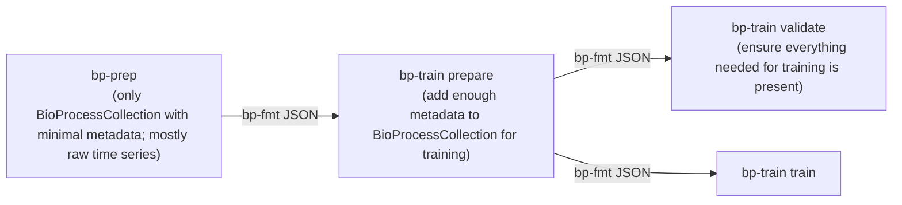

# Some notes

## Main

We should rethink data transformations and provenance in the `bp-...` pipeline:

### New `TimeSeries` class

I think it would be good to have a more feature-rich `TimeSeries` class that contains (all optional):
- metadata
- raw data
- timestamps of discontinuities
- interpolators for the data (linear or spline)
- methods for common transformations (arithmetic operations with other `TimeSeries`s, resampling, differentiation, integration, etc.)

This allows us users to manipulate data on a high level (e.g. `F_cont = (V_feed_acc + V_base_acc).deriv(1)`) without having to worry about wrangling individual `jnp.arrays`.

These transformations should handle both the interpolators and the raw data (taking care of edge cases when time points don't match up etc.)

### Higher-level data structures in `bp-fmt`

Overall, I think it's best if `bp-fmt` itself is very permissive and doesn't enforce anything.

It's purpose is to simply:
- provide data structures to represent all layers of the bioprocess data hierarchy (from `TimeSeries` to `BenchmarkDataset`)
- encode extra structural information on how these dataclasses relate to each other (but this should be permissive, we should be able to represent partial data or data with partial connectivity).
    - With no extra metadata:
        - A `bp_fmt.BioProcess` is simply a container for (optional) metadata and a collection of `TimeSeries`s.
        - A `bp_fmt.BioProcessCollection` is a list of such objects (again with optional metadata).
    - With complete metadata:
        - Each bioprocess is fully specified and transparent. We know everything one would need to know (which time series is the reactor volume, when are events (sampling, bolus feed, induction))
    - There should be validation functionality to check the additional metadata is self-consistent.
    - We might want extra validation to flag if data that's required for certain **use cases** is missing (e.g. for training a model or for admission to the `bp-bench` database), but it might be best if this is included in the respective downstream packages (`bp-train`, `bp-bench`) rather than in `bp-fmt` itself.
- reliable serialization and deserialization (JSON)
- everything should be wrapped into a `Snapshot` (or `Dataset`) class and a `bp-fmt` JSON file can contain multiple such snapshots with provenance metadata (again optional). The reasons for this are explained below.

### Notes from call on 2026-03-27

> For now, let's drop snapshots (since most transformations are complementary and not overriding)

> We'll hard-code `BioProcessCollection.controls` and `BioProcessCollection.augmented` attributes for `Controls` and `AugmentedData` objects:
> - `AugmentedData`: multi-dimensional array with `(n_proc, n_aug_traces, n_time_points, n_features)`
> - long-term we might also want augmented controls (still gotta think about how to best do this; perhaps by simply adding noise in the scaling step of the NN inputs)

## Data Journey: `bp-prep` via `bp-fmt` to `bp-train`

## Further bp_format QoL changes

- When defining a medium omitting a component should be treated as zero concentration for that component.
- We might want to rename the `FeedMedium` dataclass as it contains feed and base and potentially other medium types and the current name could confuse people. Maybe use something like "AddedMedium" or similar.
- Do we really need `ReactorMedium` and `FeedMedium` and `ReactorMediumComponent` and `FeedMediumComponent`? I realise that reactor medium components are measured and feed medium components are not, but can't this distinction is already crystallized in `process.reactor_medium` vs `process.volume.volume_changes` anyway. I think we could simplify the API here.
