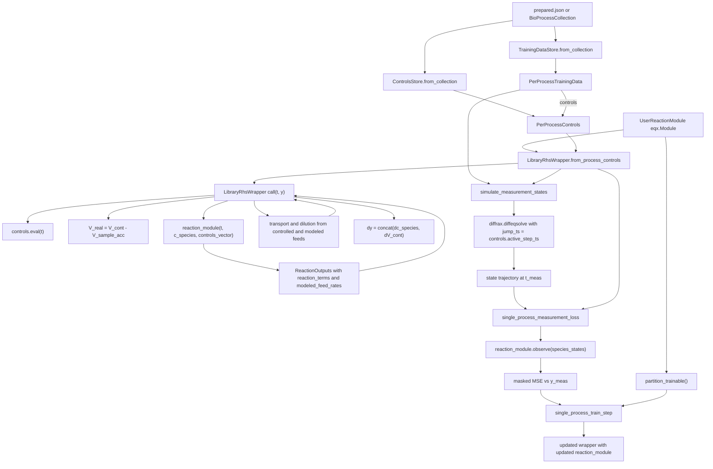
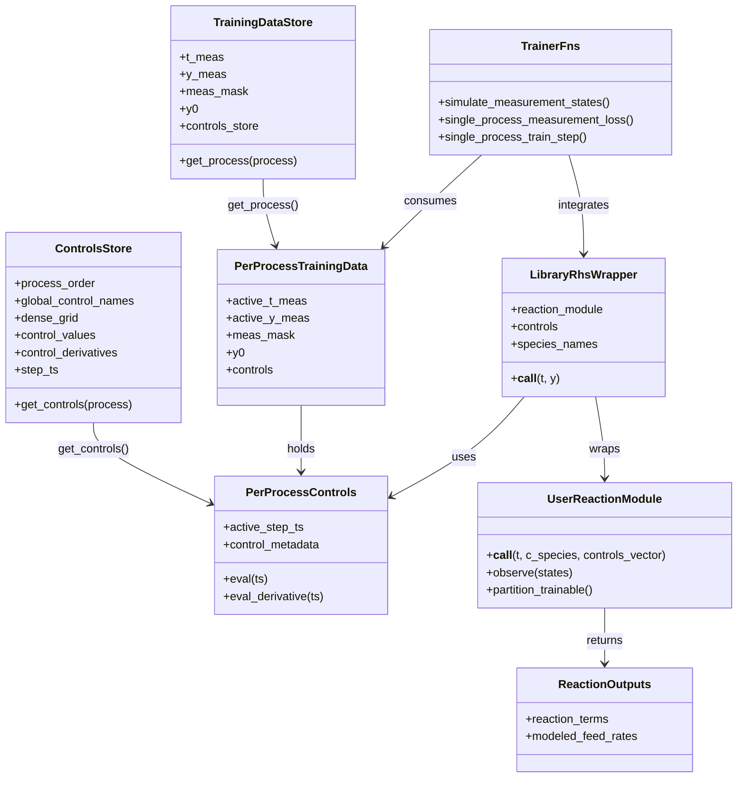

# BP-Train Runtime Wrapper Architecture (Current)

This diagram reflects the current runtime stack in `bp_train` for single-process
training (Phase C, Steps 1-5).

## Hierarchy (Objects and Ownership)

